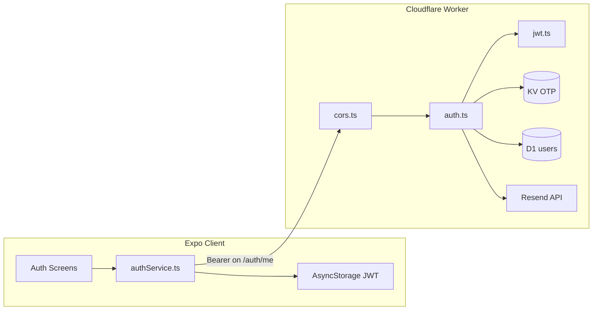

# MLetras Connect — Authentication Security & Architecture Audit

**Date:** July 2, 2026  
**Scope:** End-to-end authentication system (Cloudflare Workers API + Expo client)  
**Type:** Read-only production readiness assessment  
**Auditor role:** Staff/Principal Software Engineer — Auth, Backend Architecture, API Security

---

## 1. Executive Summary

The authentication system has a solid foundation (parameterized SQL, hashed passwords, OTP-based verification, JWT signature validation, no client-side secret leakage), but it is **not production-ready for public launch** in its current state.

Two systemic weaknesses dominate risk:

- **State-machine flaws in OTP verification** (resend + KV consume race) that can break single-use guarantees.
- **Session hardening gaps** (no server-side token revocation, long-lived bearer tokens, plaintext client token storage).

Abuse protections are also insufficient: no server-side rate limiting/throttling on OTP or login endpoints, and account enumeration is possible in OTP send flows.

### Architecture Snapshot

### Auth Endpoints Reviewed

| Method | Path | Auth Required |
|--------|------|---------------|
| POST | `/auth/otp/send` | No |
| POST | `/auth/otp/verify` | No |
| POST | `/auth/signup` | No (requires prior OTP verification in KV) |
| POST | `/auth/login` | No |
| POST | `/auth/password/reset` | No (requires prior OTP verification in KV) |
| GET | `/auth/me` | Bearer JWT |
| POST | `/auth/logout` | No (no-op server-side) |

---

## 2. Critical Issues

### C1 — OTP resend does not invalidate prior "verified" state

- **Files:** `workers/mletras-connect-api/src/lib/otp.ts` (`storeOtp`), `workers/mletras-connect-api/src/routes/auth.ts` (`/auth/otp/send`, `/auth/signup`)
- **Evidence:** `verifyOtp` sets `verified:{flow}:{email}` (15 min TTL). `storeOtp` only overwrites the OTP key; it never deletes the verified key.
- **Scenario:** User verifies email, then taps "resend" (or attacker triggers resend). Signup/password-reset can still proceed via `consumeVerification` **without entering the new code**. A prior verification remains usable for up to 15 minutes regardless of resend.
- **Recommendation:** On OTP send (and on each new code issuance), delete the corresponding `verified:*` KV key. Treat verification as bound to the active OTP generation.

### C2 — Race on `consumeVerification` (TOCTOU) enables double consumption

- **Files:** `workers/mletras-connect-api/src/lib/otp.ts` (`consumeVerification`), `workers/mletras-connect-api/src/routes/auth.ts` (`/auth/signup`, `/auth/password/reset`)
- **Evidence:** Non-atomic `get` → `delete` sequence; two concurrent requests can both read the key before either deletes it, both returning `true`.
- **Scenario:** Parallel signup requests after one OTP verify: both pass `consumeVerification`, both attempt `INSERT`. One hits UNIQUE constraint with an **unhandled** D1 error (no try/catch in handler), likely a 500. Parallel password resets can both apply. Signup race also creates ambiguous client behavior.
- **Recommendation:** Use an atomic consume primitive (e.g., delete-and-return-old-value pattern if available, or D1 transactional state) so verification is strictly single-use under concurrency.

---

## 3. High-Risk Issues

### H1 — No rate limiting or abuse controls on auth endpoints

- **Files:** `workers/mletras-connect-api/src/index.ts`, `workers/mletras-connect-api/src/routes/auth.ts`
- **Evidence:** No Cloudflare Rate Limiting, WAF rules, KV/IP counters, or CAPTCHA anywhere.
- **Scenario:** Attacker floods `/auth/otp/send` → email bombing + Resend cost abuse. Unlimited `/auth/otp/verify` attempts across refreshed OTPs. Unlimited login attempts (only PBKDF2 cost as throttle).
- **Recommendation:** Per-IP and per-email rate limits on send, verify, login, and signup; consider Cloudflare rate limiting rules or Worker-side counters with exponential backoff.

### H2 — JWTs are not invalidated on password reset or logout

- **Files:** `workers/mletras-connect-api/src/routes/auth.ts` (`/auth/password/reset`, `/auth/logout`), `workers/mletras-connect-api/src/lib/jwt.ts`
- **Evidence:** Reset updates `password_hash` only. Logout is a no-op. No token version field or denylist.
- **Scenario:** Stolen JWT remains valid for up to 30 days after victim resets password or "logs out."
- **Recommendation:** Add a `token_version` (or `password_changed_at`) column; embed in JWT and check on `/auth/me`. Optionally maintain a revocation mechanism for logout.

### H3 — User enumeration on OTP send

- **Files:** `workers/mletras-connect-api/src/routes/auth.ts` (`/auth/otp/send`)
- **Evidence:** Signup flow returns `emailTaken` if email exists; reset flow returns `accountNotFound` if it does not.
- **Scenario:** Attacker learns which emails are registered by observing error codes.
- **Recommendation:** Return uniform success for send (always `200 {ok:true}`) and only reveal existence at later stages where necessary—or use identical messaging for both flows.

### H4 — Weak server-side password policy (client bypass)

- **Files:** `workers/mletras-connect-api/src/routes/auth.ts` (signup/reset), `src/utils/password.ts` (client)
- **Evidence:** Server only checks `password.length < 8`. Client requires upper, lower, number, and match.
- **Scenario:** Direct API calls can create accounts with passwords like `12345678`.
- **Recommendation:** Enforce the same complexity rules server-side; reject common passwords.

### H5 — `workers_dev = true` in production config

- **Files:** `workers/mletras-connect-api/wrangler.toml`
- **Evidence:** `workers_dev = true` exposes the `*.workers.dev` subdomain in addition to `connect-api.mletras.com`.
- **Scenario:** Extra attack surface, potential misconfiguration exposure, split traffic across domains.
- **Recommendation:** Set `workers_dev = false` for production deployments.

### H6 — Unhandled D1 constraint violations

- **Files:** `workers/mletras-connect-api/src/routes/auth.ts` (`/auth/signup`)
- **Evidence:** No try/catch around `INSERT`; UNIQUE on `email`/`username` relies on prior SELECT (race-prone).
- **Scenario:** Concurrent signups produce 500 errors instead of `emailTaken`/`usernameTaken`; error responses may differ from normal paths (information leak + poor reliability).
- **Recommendation:** Catch constraint errors and map to stable 4xx codes; prefer DB-level uniqueness as the source of truth.

### H7 — JWT stored in plaintext AsyncStorage (not secure storage)

- **Files:** `src/services/profileService.ts`
- **Evidence:** Session key `@mletras_connect_session` stores token in unencrypted AsyncStorage. No `expo-secure-store` in dependencies.
- **Scenario:** Device backup, malware, or web XSS can exfiltrate long-lived bearer token (~30 days server TTL).
- **Recommendation:** Persist tokens in platform secure storage (Keychain/Keystore/SecureStore); consider shorter-lived access tokens + refresh flow.

### H8 — Bootstrap clears session on any `/auth/me` failure, including network errors

- **Files:** `src/context/AppContext.tsx`
- **Evidence:** `else { await clearSession(); }` with no distinction for `networkError` vs `unauthorized`.
- **Scenario:** Offline or flaky networks log users out and discard valid tokens.
- **Recommendation:** Only clear session on explicit `unauthorized`; retry or offline grace for transient failures.

---

## 4. Medium-Risk Issues

### M1 — OTP brute-force surface amplified by unlimited resend

- **Files:** `workers/mletras-connect-api/src/lib/otp.ts`, `workers/mletras-connect-api/src/routes/auth.ts`
- **Evidence:** 6-digit code (~20 bits), 5 attempts per stored OTP, 60s OTP TTL—but **no server-side resend cooldown** (client has 60s UI cooldown only).
- **Scenario:** Attacker cycles OTP send + verify attempts. With rate limits absent, expected crack time is feasible at scale.
- **Recommendation:** Server-side resend cooldown, per-email daily caps, lockout after N sends, longer codes or alphanumeric tokens.

### M2 — OTP code comparison is not constant-time

- **Files:** `workers/mletras-connect-api/src/lib/otp.ts` (`verifyOtp`)
- **Evidence:** `record.code !== code` (early-exit string compare).
- **Scenario:** Theoretical timing side-channel on OTP validation (less practical over network, but weaker than password compare).
- **Recommendation:** Use constant-time comparison for OTP strings.

### M3 — KV attempt counter is read-modify-write (race)

- **Files:** `workers/mletras-connect-api/src/lib/otp.ts` (`verifyOtp`)
- **Evidence:** On wrong code: read record, increment `attempts`, write back—not atomic.
- **Scenario:** Parallel wrong guesses may not all increment attempts, exceeding the intended 5-attempt cap.
- **Recommendation:** Atomic increment or transactional update pattern.

### M4 — `accountNotFound` on password reset after OTP verification

- **Files:** `workers/mletras-connect-api/src/routes/auth.ts` (`/auth/password/reset`)
- **Evidence:** After `consumeVerification`, if user row missing, returns `accountNotFound` (distinct from `otpNotVerified`).
- **Scenario:** Reveals account deletion between verify and reset; minor enumeration after OTP step.
- **Recommendation:** Use a generic error after verification step.

### M5 — Resend error logging may capture sensitive data

- **Files:** `workers/mletras-connect-api/src/lib/email.ts` (`sendOtpEmail`)
- **Evidence:** `console.error('Resend error:', response.status, detail)` logs full Resend response body.
- **Scenario:** Provider error payloads may include email addresses or internal metadata in Cloudflare logs.
- **Recommendation:** Log status codes and correlation IDs only; avoid raw provider bodies.

### M6 — No password max-length / request body limits

- **Files:** `workers/mletras-connect-api/src/routes/auth.ts`, `workers/mletras-connect-api/src/lib/password.ts`
- **Evidence:** PBKDF2 runs on arbitrary-length passwords; `readJson` has no size cap.
- **Scenario:** CPU exhaustion via very long passwords or large JSON payloads.
- **Recommendation:** Cap password length (e.g., 128 chars) and enforce request size limits.

### M7 — CORS fallback for unknown origins

- **Files:** `workers/mletras-connect-api/src/lib/cors.ts` (`corsHeaders`)
- **Evidence:** If `Origin` not in allowlist, `Access-Control-Allow-Origin` is set to the first allowlisted origin (`localhost:8081`), not the request origin.
- **Scenario:** Unusual CORS behavior for unknown web origins; low risk with Bearer tokens (no cookies), but confusing and not best practice.
- **Recommendation:** Omit `Access-Control-Allow-Origin` or use a strict deny for unknown origins.

### M8 — `/auth/me` can 500 on corrupt `instruments` JSON

- **Files:** `workers/mletras-connect-api/src/routes/auth.ts` (`serializeUser`)
- **Evidence:** `JSON.parse(row.instruments)` without try/catch.
- **Scenario:** Bad DB data crashes the endpoint.
- **Recommendation:** Defensive parse with fallback or DB constraint validation.

### M9 — JWT lacks `iat`, `iss`, `aud`; 30-day stateless sessions

- **Files:** `workers/mletras-connect-api/src/lib/jwt.ts`
- **Evidence:** Only `exp` time validation; no audience/issuer checks.
- **Scenario:** Tokens are long-lived with no rotation; acceptable for MVP but increases blast radius of leakage.
- **Recommendation:** Shorter access-token TTL + refresh flow, or explicit `iss`/`aud` if multiple services will verify tokens.

### M10 — Plaintext password carried in navigation params

- **Files:** `src/screens/CreatePasswordScreen.tsx`, `src/types/index.ts`, `src/screens/ProfileSetupScreen.tsx`
- **Evidence:** Password passed via `navigation.navigate('ProfileSetup', { email, password })`.
- **Scenario:** Password retained in navigation/memory longer than necessary; exposure via logs, devtools, or state restoration.
- **Recommendation:** Hold password in a short-lived in-memory ref/context cleared after signup; never pass via route params.

### M11 — OTP auto-send retriggered when locale changes on OTP screen

- **Files:** `src/screens/OtpVerificationScreen.tsx`, `src/components/AuthHeader.tsx`
- **Evidence:** `dispatchOtp` depends on `strings`; language toggle retriggers OTP send.
- **Scenario:** Duplicate OTP emails, rate limits, user confusion.
- **Recommendation:** Remove `strings` from OTP send dependencies; disable language toggle during OTP or defer locale change until next screen.

### M12 — Sign-up verification window (15 min) vs multi-step UI with no timer/guidance

- **Files:** Server `VERIFIED_TTL_SECONDS = 900` in `otp.ts`; client has no countdown or re-verify path from `ProfileSetup`
- **Scenario:** Late submission fails with `otpNotVerified`; user must guess to restart.
- **Recommendation:** Show verification expiry UX; allow re-verify without restarting entire flow.

### M13 — Hybrid mock data + real auth session

- **Files:** `src/context/AppContext.tsx`, `src/services/usersService.ts`, `src/services/postsService.ts`
- **Evidence:** Bootstrap loads mock `users`/`posts` while auth is real API.
- **Scenario:** Auth state does not match displayed data; future API migration risk of acting "logged in" against wrong data layer.
- **Recommendation:** Separate mock mode from production auth path or gate mock data behind dev flag.

---

## 5. Low-Risk Issues

### L1 — Login timing may leak user existence (minor)

- **Files:** `workers/mletras-connect-api/src/routes/auth.ts` (`/auth/login`)
- **Evidence:** Missing user skips `verifyPassword`; existing user runs 100k PBKDF2 iterations.
- **Scenario:** Network-noise-limited timing distinction between unknown email and wrong password.
- **Recommendation:** Always run a dummy PBKDF2 on unknown users (or uniform delay).

### L2 — Minimal email validation

- **Files:** `workers/mletras-connect-api/src/routes/auth.ts` (`EMAIL_REGEX`)
- **Evidence:** Permissive `^[^\s@]+@[^\s@]+\.[^\s@]+$`.
- **Recommendation:** Stricter validation or normalization (IDNA, plus-addressing policy).

### L3 — No username/instrument input bounds or format rules

- **Files:** `workers/mletras-connect-api/src/routes/auth.ts` (`/auth/signup`)
- **Evidence:** Only non-empty username; instruments stored as arbitrary JSON array.
- **Recommendation:** Length limits, charset rules, enum validation for instruments.

### L4 — No structured auth audit logging

- **Files:** Entire worker
- **Evidence:** Only one `console.error` in email path; `observability.enabled` in wrangler but no auth event logs.
- **Recommendation:** Structured logs for login success/failure, OTP send, lockouts (without logging secrets/codes).

### L5 — OTP generation uses modulo (slight bias)

- **Files:** `workers/mletras-connect-api/src/lib/otp.ts` (`generateOtpCode`)
- **Evidence:** `getRandomValues % 1_000_000` — negligible bias.
- **Recommendation:** Rejection sampling if perfection desired.

### L6 — `getSession()` lacks try/catch around `JSON.parse`

- **Files:** `src/services/profileService.ts`
- **Scenario:** Corrupt storage can crash app boot.
- **Recommendation:** Treat parse errors as invalid session and clear key.

### L7 — Login screen skips client email format validation

- **Files:** `src/screens/AuthScreen.tsx`
- **Evidence:** `EMAIL_REGEX` imported but not used.
- **Recommendation:** Validate email format before network call.

### L8 — Password reset success navigates to sign-up entry, not login

- **Files:** `src/screens/CreatePasswordScreen.tsx`
- **Evidence:** `navigation.popToTop()` on auth stack whose first screen is `SignUpEmail`.
- **Recommendation:** Navigate explicitly to `Auth` with success message.

### L9 — Generic error mapping hides OTP lockout and expiry

- **Files:** `src/services/authService.ts` (`mapAuthError`)
- **Evidence:** Maps `tooManyAttempts`, `codeExpired` to `codeRequired`.
- **Recommendation:** Distinct user-facing strings per error code.

### L10 — CORS fallback origin is localhost

- **Files:** `workers/mletras-connect-api/src/lib/cors.ts`
- **Recommendation:** Return no ACAO header for unknown origins.

---

## 6. Workflow Problems

### New User Registration

| Scenario | Current Behavior | Risk |
|----------|------------------|------|
| First-time sign up | Works end-to-end via OTP → password → profile → API | Functional |
| Existing email attempting to register | Returns `emailTaken` at OTP send | **Enumerates registered emails** |
| Expired verification code | Returns `codeExpired` | OK; client maps to generic message |
| Incorrect verification code | 5 attempts then `tooManyAttempts` | OK per-code; no global rate limit |
| Multiple verification requests | Resend does not clear verified state | **Critical bypass (C1)** |
| Multiple browser tabs | Shared AsyncStorage on web; duplicate OTP sends possible | State desync |
| User closes browser during signup | Verified flag persists 15 min in KV | Can resume if within window |
| Slow network | OTP expires in 60s; user may need resend | UX friction |
| Duplicate/race requests | `consumeVerification` TOCTOU | **Critical race (C2)** |

### Login

| Scenario | Current Behavior | Risk |
|----------|------------------|------|
| Existing user | Issues 30-day JWT | OK |
| Non-existent user | `invalidCredentials` | Good anti-enumeration |
| Invalid password | `invalidCredentials` | Good anti-enumeration |
| Multiple login attempts | No rate limiting | **Brute force (H1)** |
| Simultaneous logins | Multiple valid JWTs issued | No session limit |
| Session reuse | JWT valid until expiry | No revocation |
| Session fixation | N/A (no cookies) | Not applicable |
| Replay attacks | JWT replayable until expiry | **No revocation (H2)** |

### Forgot Password / Account Recovery

| Scenario | Current Behavior | Risk |
|----------|------------------|------|
| Email verification | OTP flow with reset flow | Functional |
| Expired reset codes | 60s OTP TTL; 15 min verified window | OK |
| Reused reset codes | OTP deleted on success; verified consumed once | OK unless race (C2) |
| Multiple reset requests | Resend does not invalidate verified state | **Critical bypass (C1)** |
| Old sessions after reset | JWTs remain valid | **Account takeover risk (H2)** |
| Token invalidation | None | **Missing** |
| Legitimate user recovery | Can reset via OTP if account exists | Works; `accountNotFound` enumerates |

### Session Management

| Area | Current State | Assessment |
|------|---------------|------------|
| Session creation | JWT on signup/login | OK |
| Session expiration | 30-day JWT `exp` | Long-lived |
| Refresh tokens | Not implemented | Missing |
| Logout | Client clears AsyncStorage; server no-op | **Incomplete** |
| Logout from all devices | Not supported | Missing |
| Multiple active sessions | Allowed | By design; no limit |
| Cookie security | N/A (Bearer header only) | Not applicable |
| HTTPOnly / Secure / SameSite | N/A (no cookies) | Not applicable |

### Email Verification

| Control | Status |
|---------|--------|
| Codes expire correctly | Yes (60s OTP, 15 min verified window) |
| Codes cannot be reused | Yes on success (OTP deleted) |
| Codes cannot be guessed | 6-digit; 5 attempts per code; **no global rate limit** |
| Codes securely stored | KV (not hashed; short TTL mitigates) |
| Rate limiting exists | **Client-only 60s cooldown** |
| Abuse prevention | **Insufficient** |
| Brute-force protection | Per-code only; resend bypasses attempt reset on verified state |

---

## 7. Security Vulnerabilities

| Category | Status | Notes |
|----------|--------|-------|
| Authentication bypasses | **Partial risk** | OTP resend + verified state bypass (C1) |
| Authorization bypasses | Low (only `/auth/me` protected) | No other protected routes yet |
| IDOR | N/A | No resource-level auth on posts/users |
| Replay attacks | **Risk** | JWT replayable; no revocation |
| Session fixation | N/A | No cookie sessions |
| Session hijacking | **Risk** | Plaintext token storage (H7) |
| CSRF | Low | Bearer token, no cookies |
| XSS → token theft | **Risk on web** | AsyncStorage → localStorage |
| SQL injection | **Secure** | Parameterized queries throughout |
| Timing attacks | Minor | Login timing leak (L1); OTP compare not constant-time (M2) |
| Information disclosure | **Risk** | User enumeration on OTP send (H3) |
| User enumeration | **Risk** | OTP send flows differ by account existence |
| Weak RNG | Low | `crypto.getRandomValues`; slight modulo bias (L5) |
| Weak token generation | Low | HS256 with secret; adequate if secret is strong |
| Predictable IDs | **Secure** | `crypto.randomUUID()` |
| Missing validation | **Risk** | Server password policy (H4); input bounds (M6) |
| Race conditions | **Critical** | Verification consumption (C2); signup INSERT |
| Duplicate account creation | Mitigated by UNIQUE | Race may cause 500 instead of clean error |
| Privilege escalation | N/A | No roles/privileges |
| Open redirects | N/A | No redirect parameters |
| Missing rate limits | **Critical gap** | All auth endpoints unprotected |
| Email abuse | **Risk** | Unlimited OTP send |
| OTP abuse | **Risk** | Resend + verify without server throttling |
| Account takeover | **Risk** | Stolen JWT survives password reset |

---

## 8. Edge Cases

- **Multiple tabs/devices:** Shared AsyncStorage on web; sign-out in one tab does not update other tabs' in-memory state until reload.
- **Concurrent signup/reset:** Both can pass `consumeVerification` before either deletes the key.
- **Resend after verify:** Verified state persists; new code not required for completion.
- **OTP expiry during multi-step flow:** User on ProfileSetup after 15 min gets `otpNotVerified` with no guided recovery.
- **App crash between setState and saveSession:** User appears logged in until restart, then logged out.
- **Email delivery failure:** Returns `502 emailSendFailed`; limited retry UX.
- **KV eventual consistency:** Read-modify-write races on attempt counters.
- **Corrupt session JSON:** `getSession()` can throw on boot.
- **Profile updates:** Mock `usersService` only; DB diverges from app state.

---

## 9. Missing Protections

- [ ] Server-side rate limits (OTP send, login, signup, verify)
- [ ] Move JWT to secure storage on device
- [ ] Token revocation strategy (logout, password reset, compromise)
- [ ] Align server password policy with client
- [ ] Reduce account enumeration on OTP endpoints
- [ ] Persist `email_verified` (and optionally `password_changed_at` for JWT invalidation)
- [ ] Protected non-auth routes with shared JWT middleware
- [ ] Replace mock `usersService` / `postsService` with API-backed data
- [ ] Disable or lock down `workers_dev` URL for production
- [ ] Environment separation (staging vs prod DB, secrets, CORS origins)
- [ ] Monitoring/alerting on auth error rates and Resend failures
- [ ] Input max-length validation on all text fields
- [ ] Username normalization and uniqueness policy (case-insensitive)
- [ ] Atomic OTP verification consumption
- [ ] Invalidate verified KV state on OTP resend
- [ ] Global 401 handler in client for future authenticated APIs
- [ ] Structured security audit logging

---

## 10. Production Readiness Assessment

| Area | Assessment |
|------|------------|
| **Failure handling** | Email failure → `502 emailSendFailed` (good). D1/KV/unhandled errors → likely unhandled 500s. |
| **Retry logic** | None server-side; client returns `networkError` on fetch failure. |
| **Consistency under latency** | KV eventual consistency + non-atomic read-modify-write → races on OTP attempts and verification consumption. |
| **Status codes** | Mostly 400; `401` for `/auth/me`; `502` for email; `404` for unknown routes. No global error envelope. |
| **Observability** | Platform observability enabled; no auth metrics, tracing, or security event logging. |
| **Idempotency** | Signup/reset are not idempotent; duplicate submits have race behavior. |
| **CSRF** | Not applicable to Bearer-header mobile API; no cookies set. |
| **Authorization** | Only `/auth/me` checks auth; no resource-level authorization exists yet on backend. |
| **Secrets management** | Wrangler secrets for JWT/Resend; not in repo. Client has only public API URL. |
| **CORS** | Explicit allowlist for web clients. Native apps bypass CORS. |

**Verdict:** MVP-capable but **not launch-hard** for a public-facing authentication surface.

---

## 11. Recommended Improvements (Descriptive Only)

### Immediate (before public launch)

1. **Fix OTP state machine:** Invalidate verified KV keys on every OTP resend; ensure verification is bound to the active code generation.
2. **Atomic verification consumption:** Replace get-then-delete with an atomic consume operation to prevent TOCTOU races.
3. **Add rate limiting:** Per-IP and per-email limits on all auth endpoints via Cloudflare Rate Limiting or Worker-side KV counters.
4. **Token invalidation:** Add `token_version` or `password_changed_at` to users table; check on `/auth/me`; invalidate on password reset.
5. **Server-side password policy:** Enforce the same complexity rules as the client.
6. **Disable `workers_dev`:** Set to `false` for production deployments.

### Short-term

7. **Secure token storage:** Move JWT from AsyncStorage to expo-secure-store (Keychain/Keystore).
8. **Reduce enumeration:** Return uniform responses on OTP send regardless of account existence.
9. **Bootstrap resilience:** Only clear session on `unauthorized`, not on network errors.
10. **OTP UX hardening:** Stabilize auto-send behavior; show expiry countdown; distinct error messages for lockout/expiry.
11. **Input validation:** Max-length on passwords and all text fields; enum-check instruments server-side.
12. **Error handling:** Catch D1 constraint violations and map to stable 4xx codes.

### Medium-term

13. **Session model:** Shorter access-token TTL + refresh tokens, or explicit logout revocation.
14. **Auth middleware:** Shared `requireAuth()` for future protected routes.
15. **Wire profile/posts to API:** Replace mock services with JWT-authenticated endpoints.
16. **Structured audit logging:** Login success/failure, OTP events, lockouts (no secrets in logs).
17. **Environment separation:** Staging vs production DB, secrets, CORS origins.
18. **Monitoring:** Alert on auth error rate spikes and Resend delivery failures.

---

## 12. Overall Authentication Score

### **61 / 100**

Strong cryptographic and basic workflow foundation, but significant gaps in abuse prevention, session invalidation, and OTP race hardening materially lower the score.

| Dimension | Score | Notes |
|-----------|-------|-------|
| Password storage | 85 | PBKDF2-SHA256, 100k iterations, per-salt |
| OTP flow design | 45 | Resend bypass + race conditions |
| Session management | 40 | No revocation, long TTL, plaintext storage |
| Rate limiting / abuse | 15 | Effectively none server-side |
| Input validation | 55 | Client stronger than server |
| Anti-enumeration | 50 | Login good; OTP send bad |
| Error handling | 60 | Consistent codes; some unhandled paths |
| Client security | 55 | AsyncStorage, nav params for password |

---

## 13. Overall Production Readiness Score

### **54 / 100**

Usable for controlled beta/MVP, but below threshold for a major public launch without addressing critical and high issues first.

| Dimension | Score | Notes |
|-----------|-------|-------|
| Core functionality | 75 | Signup, login, reset, logout work end-to-end |
| Security hardening | 45 | Critical OTP and session gaps |
| Abuse resistance | 20 | No rate limiting |
| Operational readiness | 50 | Observability enabled; no auth-specific monitoring |
| Data consistency | 55 | Mock/API split; race conditions |
| UX reliability | 60 | Offline logout; OTP expiry UX gaps |
| Configuration | 65 | Secrets managed well; workers_dev concern |

---

## Appendix A: Areas Reviewed and Appear Secure

1. **Password storage** — PBKDF2-SHA256 with 100,000 iterations, 16-byte random salt, stored as `salt:hash`.
2. **Password verification timing** — Constant-time byte comparison in `verifyPassword`.
3. **JWT signature verification** — Constant-time signature compare; expired tokens rejected via `exp`.
4. **SQL injection resistance** — All D1 queries use `.prepare().bind()` parameterized statements.
5. **Login error uniformity** — `invalidCredentials` for bad email format, missing user, and wrong password.
6. **OTP single-use on success** — Correct code deletes OTP record before setting verified flag.
7. **Verification TTL** — Verified flag expires in 15 minutes, limiting signup/reset window.
8. **Secrets handling** — `JWT_SECRET` and `RESEND_API_KEY` documented as wrangler secrets; not in repo.
9. **CORS allowlist** — Explicit origin set for known dev/prod frontends; not wildcard `*`.
10. **`/auth/me` defense in depth** — Validates JWT **and** confirms user still exists in D1 by `sub`.
11. **Email normalization** — `trim().toLowerCase()` on all email inputs reduces duplicate-account variants.
12. **No secrets in client bundle** — Only `EXPO_PUBLIC_API_URL` in client config.
13. **Bootstrap token validation** — Stored token validated via `/auth/me` on startup before restoring session.
14. **Client password rules** — Enforces length, case, number, and confirmation match before submission.
15. **No password persistence** — Login/sign-up passwords not written to AsyncStorage.
16. **Bearer token not logged** — No console logging of tokens or passwords in auth code.
17. **HTTPS default API URL** — `config/api.ts` defaults to `https://connect-api.mletras.com`.

---

## Appendix B: Files Reviewed

### Backend (Cloudflare Worker)

- `workers/mletras-connect-api/src/index.ts`
- `workers/mletras-connect-api/src/routes/auth.ts`
- `workers/mletras-connect-api/src/lib/jwt.ts`
- `workers/mletras-connect-api/src/lib/otp.ts`
- `workers/mletras-connect-api/src/lib/password.ts`
- `workers/mletras-connect-api/src/lib/email.ts`
- `workers/mletras-connect-api/src/lib/cors.ts`
- `workers/mletras-connect-api/src/db/schema.sql`
- `workers/mletras-connect-api/wrangler.toml`
- `workers/mletras-connect-api/.env.example`

### Frontend (Expo Client)

- `src/services/authService.ts`
- `src/services/profileService.ts`
- `src/context/AppContext.tsx`
- `src/context/AuthLanguageContext.tsx`
- `src/navigation/RootNavigator.tsx`
- `src/screens/AuthScreen.tsx`
- `src/screens/SignUpEmailScreen.tsx`
- `src/screens/OtpVerificationScreen.tsx`
- `src/screens/CreatePasswordScreen.tsx`
- `src/screens/ForgotPasswordScreen.tsx`
- `src/screens/ProfileSetupScreen.tsx`
- `src/utils/password.ts`
- `src/config/api.ts`
- `src/constants/auth.ts`
- `src/types/index.ts`

---

*This document is a read-only audit. No code changes were made as part of this assessment.*
